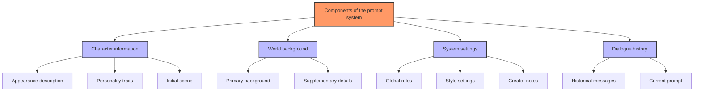
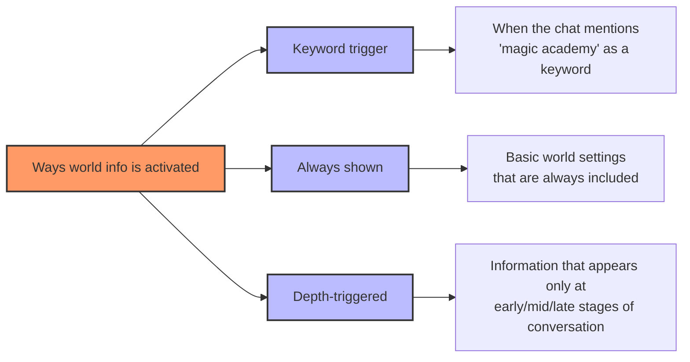
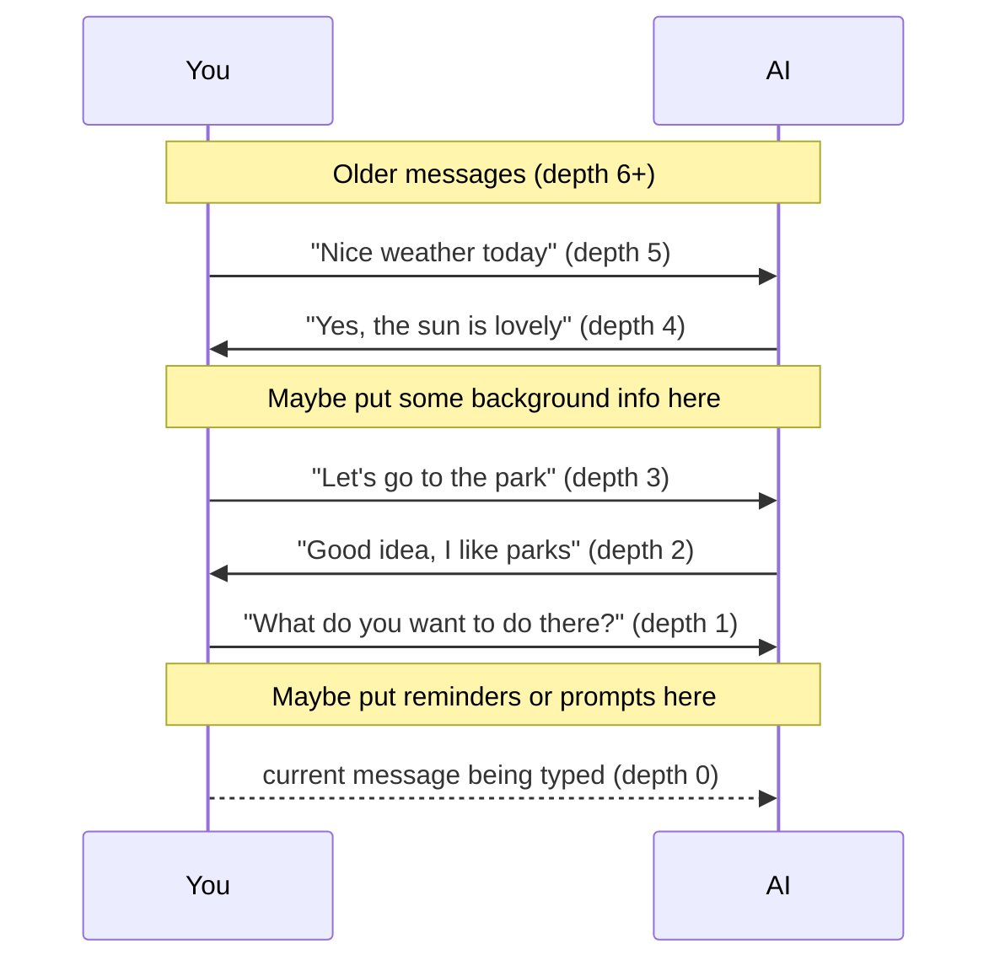
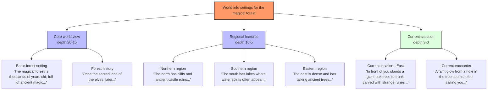
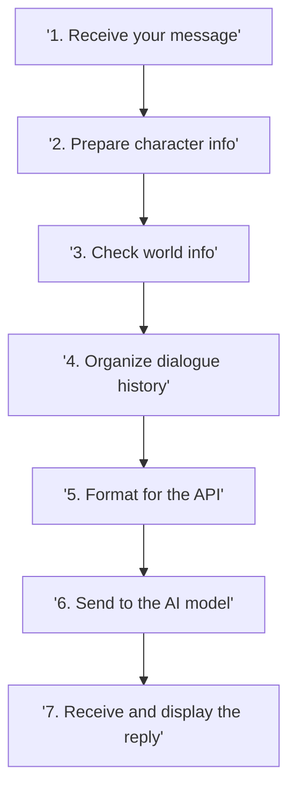
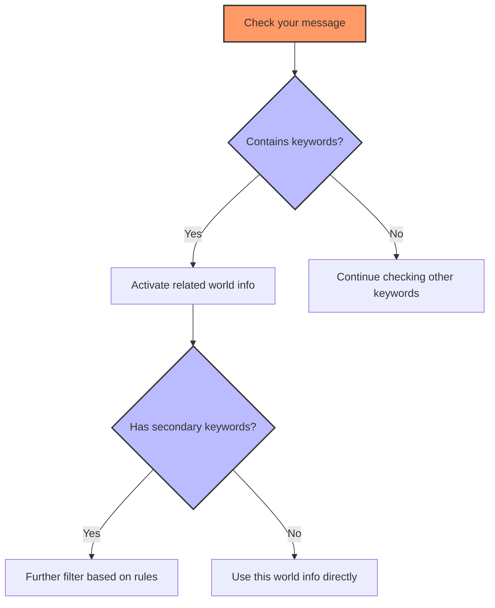
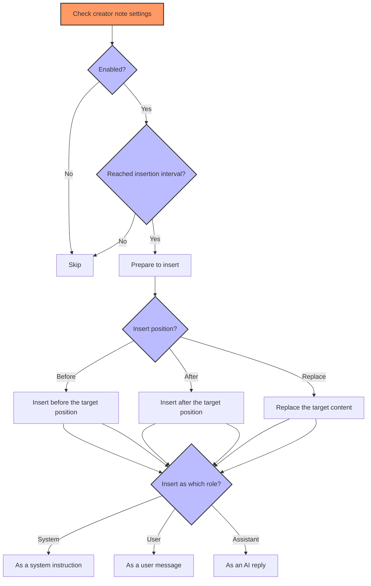
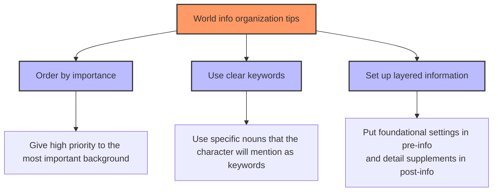
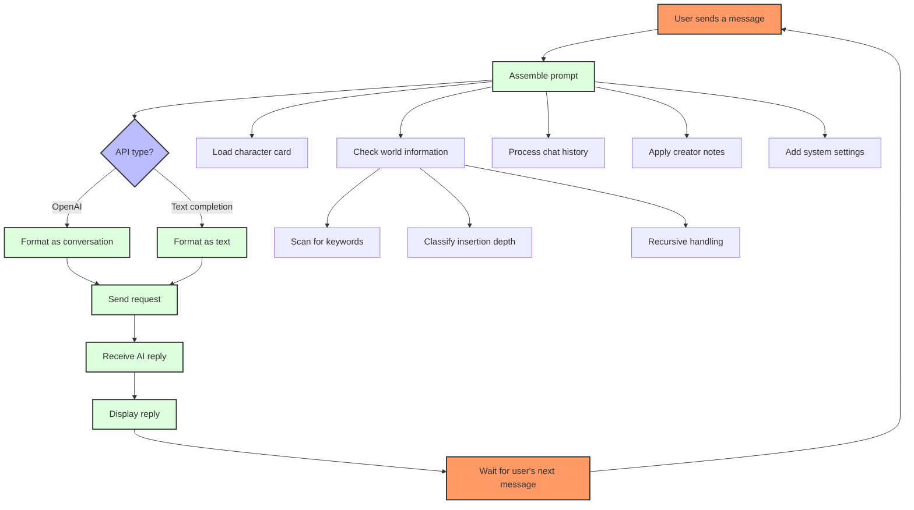

# SillyTavern Prompt System Analysis

[More detailed version including code analysis](WITHCODE.md)

## 1. What is the prompt system?

SillyTavern's prompt system is like a "script guide" for the AI — it tells the AI how to play a role, what background story to remember, how to consider dialogue history, and how to respond in the way you expect. This system is made up of multiple [...]



## 2. Basic components

### 1. Character card — the "ID card" for your AI companion

A character card is like an "ID card" for an AI character and contains:

- **Character description**: Basic info like appearance, age, height
- **Personality traits**: Temperament, hobbies, speaking style
- **Scene setting**: Where the character is and what they're doing
- **Example dialogues**: Samples showing how the character speaks

> Tip: The more detailed and specific the character card, the better the AI will portray the character. Avoid vague descriptions like "she is friendly"; use specific examples: "She always greets neighbors with a smile and remembers their children's names..." 

### 2. World information — the "encyclopedia" of the story world

World information serves as the encyclopedia of the world the character lives in and contains various background knowledge:

- **Primary (pre) world info**: Placed before the conversation starts to establish core background
- **Supplementary (post) world info**: Placed after to add extra details
- **Dynamic world info**: Appears dynamically based on conversation depth



> Example: If you created world info for a "magic academy", as soon as the conversation mentions the keyword "magic academy", the relevant information will be added to the instructions sent to the AI.

### 3. System settings — the AI's "rules of behavior"

System settings are the rule set that controls the AI's overall behavior:

- **System prompt**: Global behavior guidance
- **Personality adjustments**: Tweak response style
- **Preferences**: Guide the AI toward certain kinds of replies
- **Creator notes**: Special guidance you can insert regularly

> Creator's note example: You could set a creator note to be inserted every 5 messages: "Remember to keep an air of mystery; do not reveal too many details about the protagonist's background," to steer the story.

### 4. Dialogue history — the AI's "memory"

Dialogue history is the record of your prior exchanges with the AI, so the AI knows:

- What was previously said
- The current conversational context
- Development of relationships between characters

## 3. Conversation depth — understanding the AI's "memory position"

Conversation depth refers to a message's position in history, from newest to oldest:

- Depth 0: The message currently being sent
- Depth 1: The most recent AI reply
- Depth 2: Your previous message
- Depth N: Earlier messages



Practical uses of depth:

1. Creator note positioning:
   - Depth 0–1: Directly affects current reply
   - Depth 5+: Influences overall direction of the conversation

2. Insertion of world information:
   - Large depth: Put foundational world information
   - Small depth: Put current situational details

> Tip: For long-lasting settings (like overall world lore), place them at larger depths; for temporary instructions (like "make the character afraid now"), place them at depth 0–1.

### Example: inserting world info by depth

Imagine a fantasy adventure where the protagonist explores an ancient magical forest. Here's how to use different depths of world info to enhance the story experience:



Depth-by-depth world info example:

- Conversation start (large depth):
  1. Depth 20: Insert "magical forest core setting" so the AI understands the overall world.
  2. Depth 15: Insert "forest history" to lay groundwork for later plot hooks.

- During exploration (mid depth):
  1. Depth 8: When the player mentions "go east", activate the "Eastern region" info.
  2. Depth 5: As the player continues exploring, provide more details about the east.

- Current interaction (small depth):
  1. Depth 2: When the player nears a specific location, activate "current location — East".
  2. Depth 0: When the player inspects the tree hole, immediately activate the "current encounter" info.

#### Example dialogue

```mermaid
sequenceDiagram
    participant Player
    participant AI
    
    Note over Player,AI: depth 20: Insert magical forest core setting
    Note over Player,AI: depth 15: Insert forest history
    
    Player->>AI: "I want to explore the forest"
    AI->>Player: "You stand at the edge of the magical forest; ancient trees emit a mysterious aura..."
    
    Note over Player,AI: depth 8: Insert region info
    
    Player->>AI: "I head east"
    AI->>Player: "You head east where the trees grow denser. Legends speak of talking ancient trees..."
    
    Note over Player,AI: depth 5: Insert more east-region details
    
    Player->>AI: "I venture deeper into the east"
    AI->>Player: "As you go deeper, you notice strange patterns on the bark..."
    
    Note over Player,AI: depth 2: Insert current location info
    
    Player->>AI: "I look for any special trees nearby"
    AI->>Player: "You find a giant oak covered in ancient runes..."
    
    Note over Player,AI: depth 0: Insert current encounter info
    
    Player->>AI: "I approach the oak"
    Note over Player,AI: (For the current message, the AI will combine all relevant depth info when replying)
```

This example shows how to use different depths of world info to build layered narrative:
- Deep info (large depth) provides foundational background and ensures the AI understands the world.
- Mid-level info reveals regional features gradually as the player explores.
- Shallow info (small depth) supplies immediate situational details for the current interaction.

By layering info like this, the AI can maintain consistent worldbuilding while responding in ways highly relevant to the current interaction, creating a more immersive exploration experience.

## 4. Prompt assembly — how the AI "understands" instructions

When you send a message, SillyTavern follows these steps:



### How is world info "activated"?



> Example: If you set "coffee shop" as a main keyword and "menu" as a secondary keyword with a rule requiring both, the world info will only be activated when the conversation mentions both "coffee shop" and "menu".

### How do creator notes work?



> Practical use: You can set a creator note to be inserted every 3 messages: "Remember to describe the scene and the characters' emotions", as a system prompt at depth 0 (before the current message), so the AI will be guided to do so.

## 5. Prompt formats for different APIs

Different AI services expect different prompt formats; SillyTavern adapts automatically:

### OpenAI-style (e.g., ChatGPT)

```
[system] character description, personality, scene
[user] Hello
[assistant] Character's reply
[user] Latest message
```

### Text-completion-style (e.g., most local models)

```
Character description
Personality traits
Scene setting
World information
User: First user message
Character: First character reply
...
User: Latest message
Character: 
```

## 6. Tips — help the AI better understand your intent

### 1. Writing character cards

- Specific beats vague: give concrete examples of behavior and tone
- Avoid contradictions: don't say "introverted" in one place and "outgoing" in another
- Add dialogue examples: show the character's speaking style and tone

### 2. Organizing world info



- Keyword selection: use concrete terms likely to appear in dialogue
- Recursive activation: allow world info to trigger other world info
- Minimum activation: ensure at least N pieces of world info are included

### 3. Using creator notes

- Correcting deviations: remind the AI when it strays from the character
- Driving the plot: guide the story toward desired outcomes
- Controlling atmosphere: adjust emotional tone of replies

> Example: In an adventure you might add a creator note: "Now increase tension; describe the character hearing a strange sound in the distance," to push the plot forward.

## 7. FAQ

### 1. My character keeps forgetting previous statements — what should I do?
- Check token limits to ensure history isn't being truncated excessively
- Periodically summarize important facts in creator notes

### 2. How to make the character's replies more creative?
- Encourage creativity and variety in the system prompt
- Increase the temperature parameter where applicable

### 3. World info not triggering correctly?
- Check that the keyword actually appears in the conversation
- Verify secondary keyword rules are set correctly
- Consider using a minimum-activation mechanism

### 4. How to handle very long background stories?
- Split the background into multiple world info entries
- Use a keyword hierarchy: main locations/characters as primary keywords
- Use depth settings to keep foundational details always available

## 8. Full process diagram



## 9. Summary

SillyTavern's prompt system is a thoughtfully designed mechanism that lets you:

1. Create rich characters
2. Build complex world backgrounds
3. Guide the direction of dialogue
4. Ensure replies are coherent and consistent

Understanding how this system works will help you craft more immersive AI roleplay experiences, enabling the AI to better understand your intent and produce more vivid, coherent dialogues and stories.
