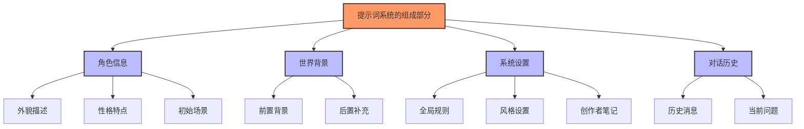
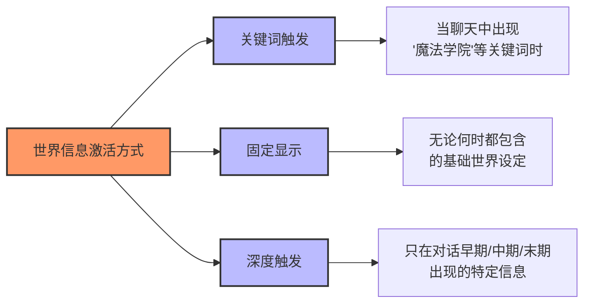
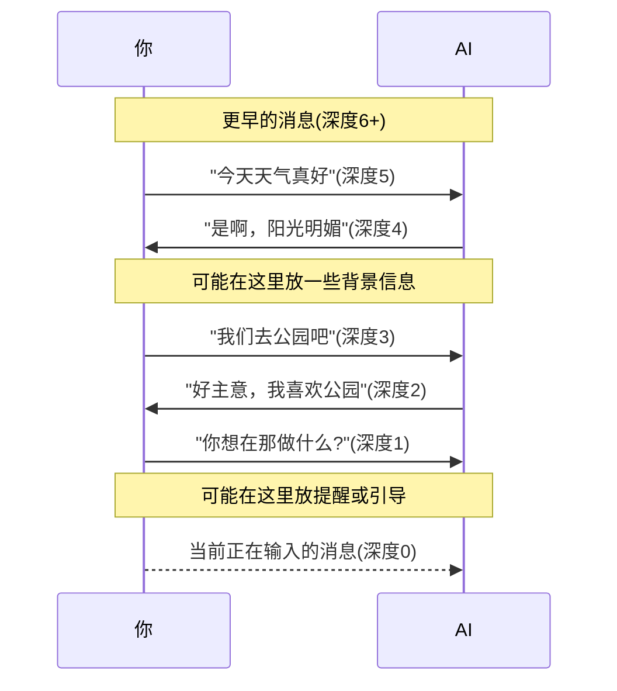
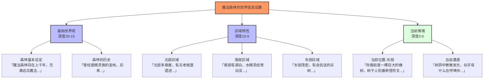
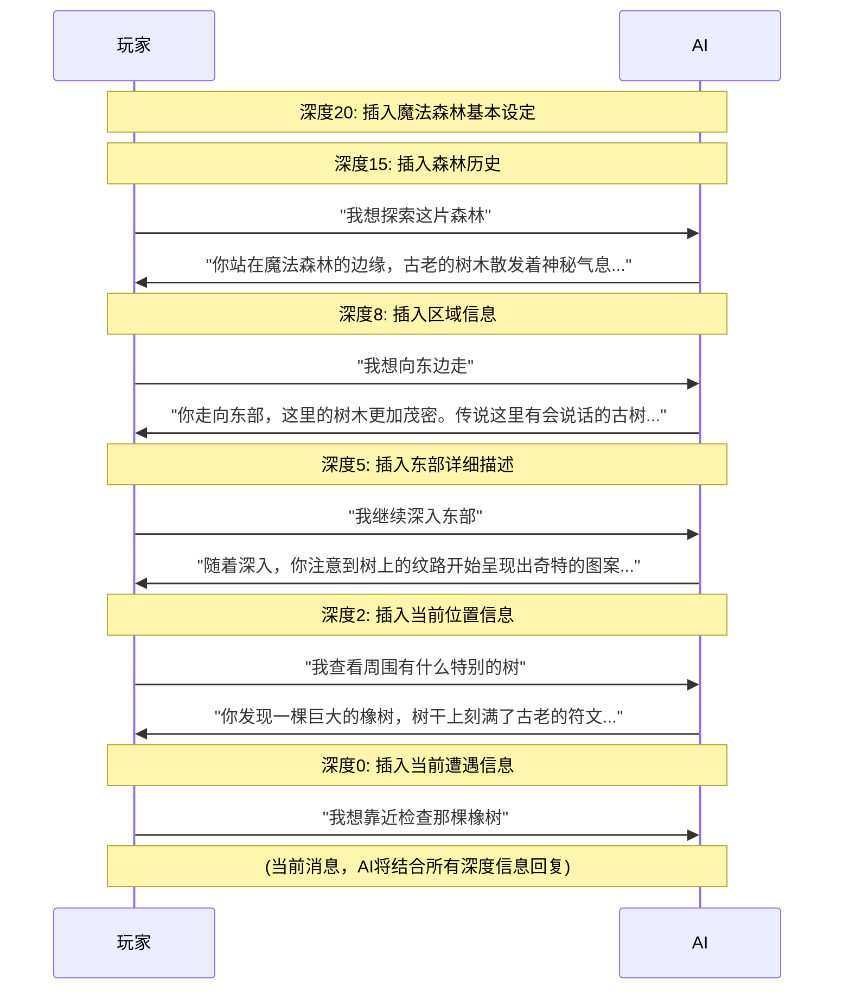
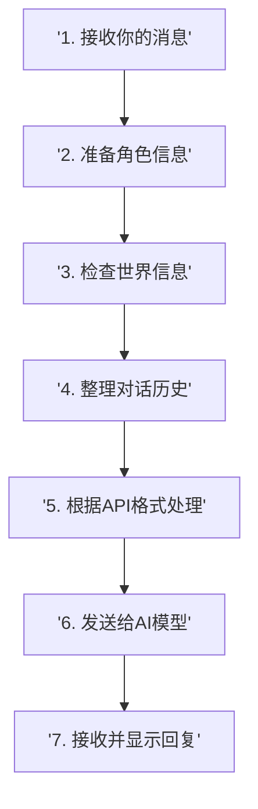
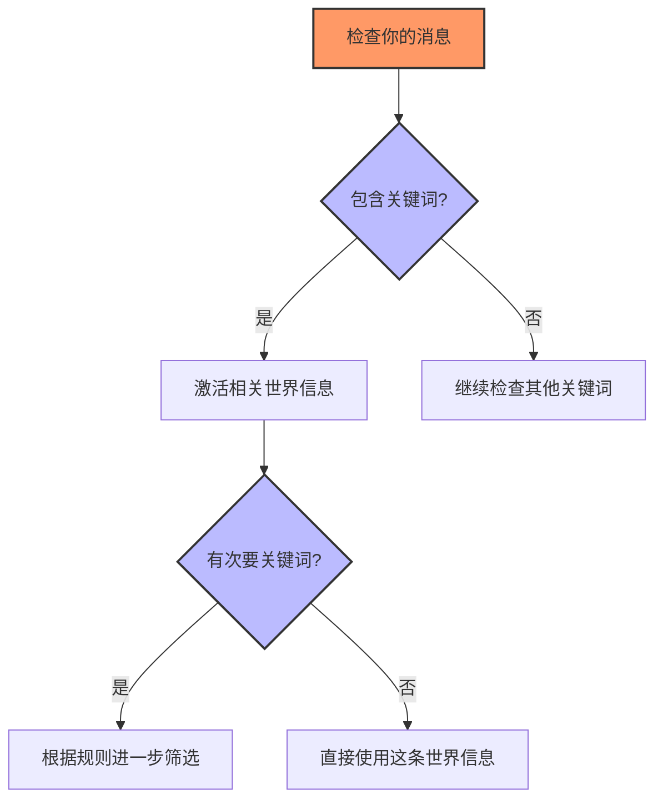
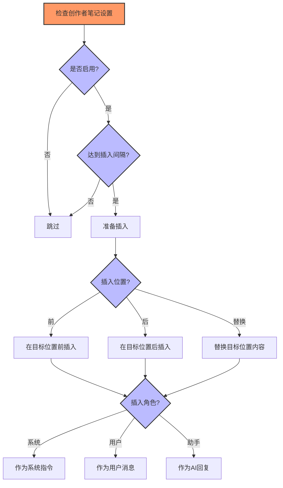
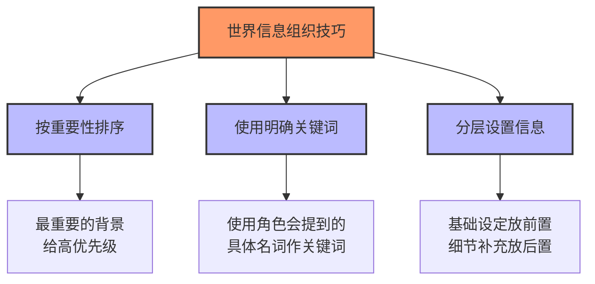
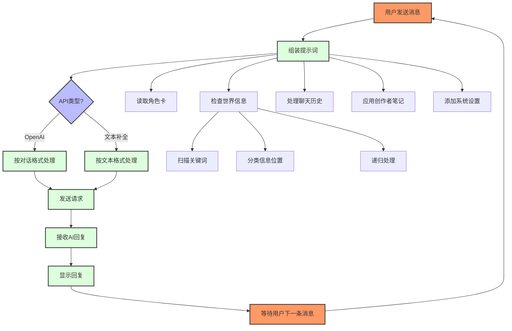

# SillyTavern提示词系统指南 

[包含代码分析的、更为详尽的版本](WITHCODE.md)

## 一、什么是提示词系统？

SillyTavern的提示词系统就像是一个给AI的"剧本指导"，它告诉AI如何扮演角色、了解背景故事、记住对话历史，并按照你期望的方式回应。这个系统由多个部分组成，像拼图一样最终组合成完整的指令发送给AI模型。



## 二、基本组成部分

### 1. 角色卡 - 你的AI伙伴的"身份证"

角色卡就像是AI角色的"身份证"，包含了:

- **角色描述**：外貌特征、年龄、身高等基本信息
- **性格特点**：脾气、爱好、说话方式等
- **场景设定**：角色在什么环境中，正在做什么
- **示范对话**：展示角色如何说话的例子

> **小提示**：角色卡越详细具体，AI就能扮演得越到位。不要用模糊的描述如"她很友好"，而是用具体的例子："她总是微笑着问候邻居，并记得他们孩子的名字"。

### 2. 世界信息 - 故事的"百科全书"

世界信息就像是角色生活的世界的"百科全书"，包含各种背景知识：

- **前置世界信息**：放在对话开始前，设定基本背景
- **后置世界信息**：放在对话后面，补充细节
- **动态世界信息**：根据对话深度（聊天进行的程度）动态出现的信息



> **实例**：如果你创建了关于"魔法学院"的世界信息，只要对话中提到"魔法学院"这个关键词，相关信息就会被添加到给AI的指令中。

### 3. 系统设置 - 给AI的"行为准则"

系统设置是控制AI整体行为的"规则集"：

- **系统提示**：全局行为指导
- **个性设定**：调整回复风格
- **偏好设置**：引导AI更倾向于某些回复方式
- **创作者笔记**：你可以定期插入的特殊指导

> **创作者笔记示例**：你可以设置每5条消息插入一次"记得保持神秘感，不要透露太多关于主角身世的信息"，来引导故事发展。

### 4. 对话历史 - AI的"记忆"

对话历史就是你和AI之前的交流记录，让AI知道：

- 之前说了什么
- 当前的对话上下文
- 角色关系的发展

## 三、聊天深度 - 理解AI的"记忆位置"

聊天深度是指消息在历史中的位置，从新到旧：

- **深度0**：当前即将发送的消息
- **深度1**：最近的一条AI回复
- **深度2**：你上一条发送的消息
- **深度N**：更早的消息



**深度的实际应用**：

1. **创作者笔记位置**：
   - 深度0-1：直接影响当前回复
   - 深度5+：影响整体对话方向

2. **世界信息插入**：
   - 深度大：放入基础世界观
   - 深度小：放入当前情境

> **小技巧**：对于长期稳定的设定（如世界观），放在较大深度；对于临时提醒（如希望角色现在害怕），放在深度0-1。

### 世界信息按深度插入的实际例子

想象你正在进行一个奇幻冒险故事，主角正在探索一个古老的魔法森林。以下是如何利用不同深度的世界信息增强故事体验：



#### 对话深度世界信息实例

**对话开始时**（深度较大）：
1. **深度20**：包含"魔法森林基本设定"，让AI了解整个世界观
2. **深度15**：包含"森林的历史"，为后续剧情埋下伏笔

**对话进行中**（区域探索时）：
1. **深度8**：当玩家提到"向东走"时，激活"东部区域"的世界信息
2. **深度5**：玩家继续探索时，提供更多关于东部地区的细节

**当前互动**（深度较小）：
1. **深度2**：玩家靠近特定地点时，激活"当前位置-东部"信息
2. **深度0**：玩家查看树洞时，立即激活"当前遭遇"信息

#### 实际对话示例



这个例子展示了如何利用不同深度的世界信息来构建层次分明的叙事体验：
- **深层信息**（深度大）提供基础背景，确保AI理解整体世界观
- **中层信息**（中等深度）提供区域特点，随玩家探索逐步展开
- **浅层信息**（深度小）提供即时情境，对当前互动做出反应

通过这种分层设置，AI可以在保持世界观一致性的同时，提供与当前互动高度相关的回应，创造出身临其境的探索体验。

## 四、提示词组装过程 - AI如何"理解"指令

当你发送消息时，SillyTavern会按照以下步骤处理：



### 世界信息是如何被"激活"的？



> **例子**：如果你设置了关键词"咖啡店"，次要关键词"菜单"，规则为"都需要"，那么只有当对话中同时提到"咖啡店"和"菜单"时，这条世界信息才会被激活。

### 创作者笔记是如何工作的？



> **实际应用**：你可以设置创作者笔记每3条消息插入一次"请记得描述场景和角色的情绪"，作为系统提示，在深度0位置（当前消息前）插入，这样AI会定期被提醒关注描写细节。

## 五、不同API的提示词格式

不同的AI服务对提示词的要求不同，SillyTavern会自动调整：

### OpenAI格式（如ChatGPT）

```
[系统提示]角色描述、性格、场景
[用户]你好
[助手]角色的回复
[用户]最新消息
```

### 文本补全格式（如大多数本地模型）

```
角色描述
性格特点
场景设定
世界信息
用户: 第一条消息
角色: 第一条回复
...
用户: 最新消息
角色: 
```

## 六、使用技巧 - 让AI更好地理解你的意图

### 1. 角色卡编写技巧

- **具体胜于抽象**：用具体例子描述性格
- **避免矛盾**：不要在一处说角色内向，另一处又说活泼
- **添加对话示例**：展示角色的说话方式和语气

### 2. 世界信息组织技巧



- **关键词选择**：使用对话中可能出现的具体词汇
- **递归激活**：设置世界信息可以触发其他世界信息
- **最小激活**：确保至少有N条世界信息被包含

### 3. 创作者笔记应用场景

- **纠正偏离**：当角色开始偏离设定时提醒
- **情节推进**：引导故事向特定方向发展
- **氛围控制**：调整回复的情感基调

> **示例**：在探险故事中，可以设置创作者笔记"现在应该增加紧张感，描述角色听到远处的奇怪声音"，以推动情节发展。

## 七、常见问题解答

### 1. 角色总是忘记之前说过的话怎么办？
- 检查你的token限制，确保历史消息没有被过度截断
- 在创作者笔记中定期总结重要信息

### 2. 如何让角色的回复更有创意？
- 在系统提示中鼓励创意和多样性
- 适当提高温度参数(temperature)

### 3. 世界信息没有被正确触发？
- 检查关键词是否在对话中出现
- 确认次要关键词规则设置正确
- 考虑使用最小激活机制

### 4. 如何处理长篇故事背景？
- 拆分成多个世界信息条目
- 使用关键词层级：主要地点/人物作为主关键词
- 利用深度设置让基础设定始终可见

## 八、完整流程示意图



## 九、总结

SillyTavern的提示词系统是一个精心设计的机制，它让你可以：

1. 创建丰富多彩的角色
2. 构建复杂的世界背景
3. 引导对话的发展方向
4. 确保AI回应的连贯性和一致性

理解这个系统的工作原理，可以帮助你创造更加沉浸式的AI角色扮演体验，让AI更准确地理解你的意图，创造出更加生动、连贯的对话和故事。 
