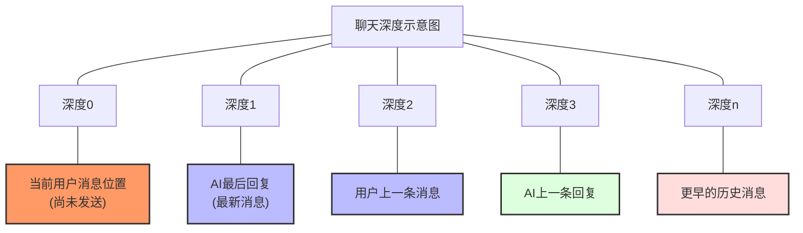
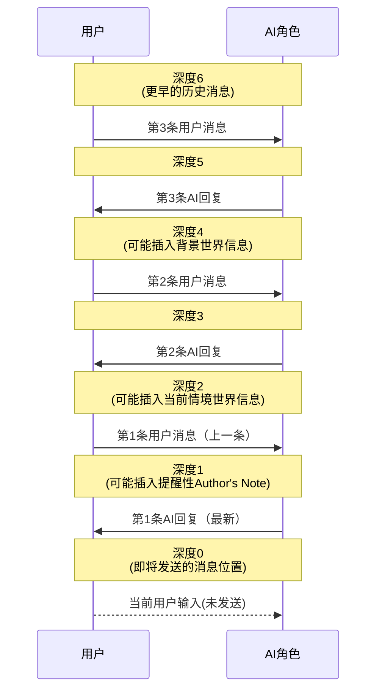
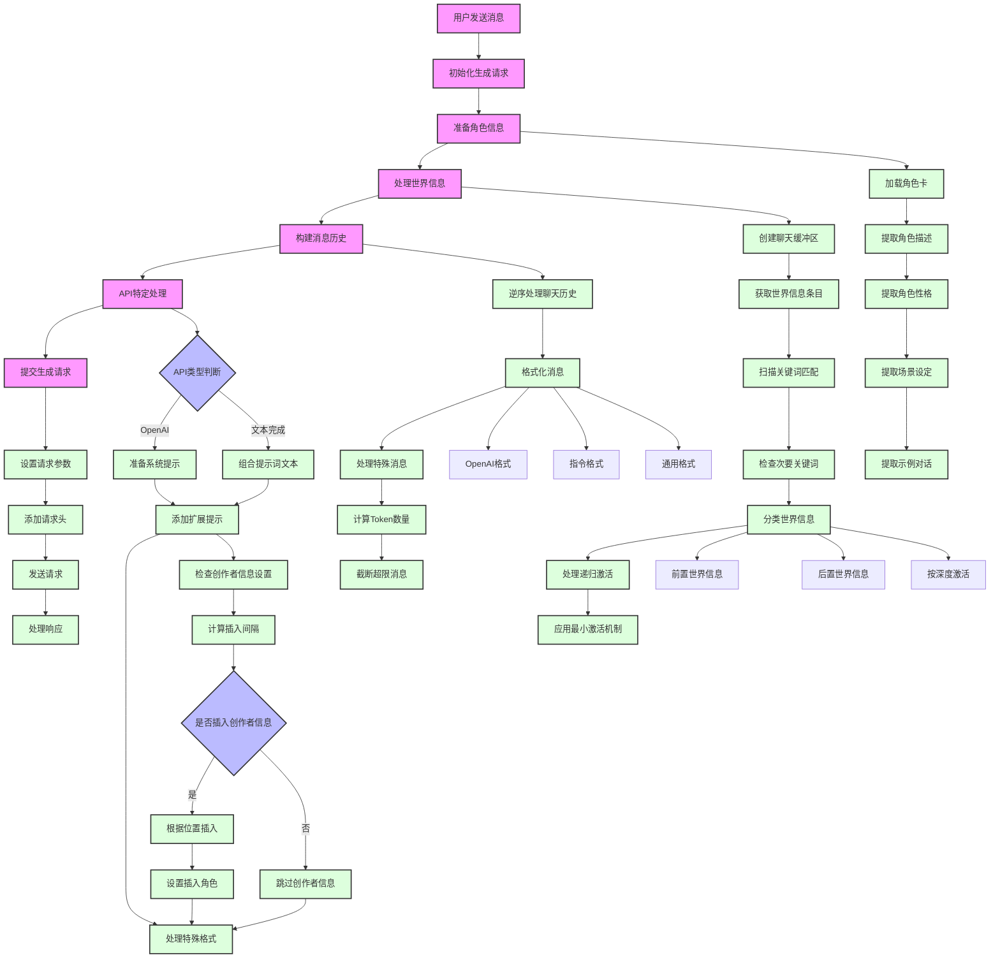

# SillyTavern提示词组合详解

## 一、基础组件介绍

SillyTavern通过多个组件构建完整的提示词体系，每个组件都有特定的功能和作用范围：

### 1. 角色卡组件
- **角色描述(Character Description)**: 定义角色的外观、背景等基本信息
- **角色人格(Character Personality)**: 描述角色的性格特点和行为模式
- **场景设定(Scenario)**: 提供角色与用户交互的初始场景
- **示例对话(Example Messages)**: 展示角色的对话风格和互动方式

### 2. 世界信息组件
- **前置世界信息(World Info Before)**: 放置在提示词前部的背景设定
- **后置世界信息(World Info After)**: 放置在提示词后部的补充信息
- **按深度激活的世界信息**: 根据聊天深度动态插入的世界信息

### 3. 系统设置组件
- **系统提示(System Prompt)**: 控制AI整体行为的全局规则
- **即时提示(Persona/Jailbreak)**: 用于特定风格或解除限制的提示词
- **偏好设置(Bias)**: 引导AI回复倾向的权重设置
- **创作者信息(Author's Note/Creator Note)**: 灵活插入的额外指导信息

### 4. 会话组件
- **聊天历史(Chat History)**: 之前的对话内容
- **用户消息(User Message)**: 用户刚刚发送的消息

## 二、提示词组装流程详解

### 步骤1: 初始化生成请求

当用户发送消息时，SillyTavern调用`Generate`函数开始处理：

```javascript
export async function Generate(type, { automatic_trigger, force_name2, quiet_prompt, quietToLoud, skipWIAN, force_chid, signal, quietImage, quietName, depth = 0 } = {}, dryRun = false) {
    // 准备生成环境...
    const abort_controller = new AbortController();
    abortController = abort_controller;
    // ...
}
```

### 步骤2: 准备角色信息

系统加载并处理角色卡中的基本信息：

```javascript
// 1. 获取角色基本设置
const context = getContext();
name1 = context.name1; // 用户名称
name2 = context.name2; // 角色名称
character = context.characters[context.characterId]; // 角色数据
// ...

// 2. 提取角色卡内容
const storyStringParams = {
    description: description,     // 角色外观描述
    personality: personality,     // 角色性格
    persona: persona,             // 用户角色设定
    scenario: scenario,           // 场景描述
    system: system,               // 系统行为指令
    char: name2,                  // 角色名称
    user: name1,                  // 用户名称
    // ...
};

// 3. 格式化角色信息
const storyString = renderStoryString(storyStringParams);
```

### 步骤3: 处理世界信息(World Info)

系统执行复杂的世界信息检索和激活过程：

```javascript
// 1. 准备聊天内容用于世界信息扫描
const chatForWI = coreChat.map(x => world_info_include_names ? `${x.name}: ${x.mes}` : x.mes).reverse();

// 2. 获取激活的世界信息
const { worldInfoString, worldInfoBefore, worldInfoAfter, worldInfoExamples, worldInfoDepth } = 
    await getWorldInfoPrompt(chatForWI, this_max_context, dryRun);
```

`getWorldInfoPrompt`函数内部工作流程：

1. 创建聊天缓冲区：
```javascript
const buffer = new WorldInfoBuffer(chat);
```

2. 获取并排序世界信息条目：
```javascript
const sortedEntries = await getSortedEntries();
```

3. 扫描激活条件：
```javascript
for (let entry of sortedEntries) {
    // 检查禁用状态
    if (entry.disable == true) {
        continue;
    }
    
    // 检查角色筛选条件
    if (entry.characterFilter && entry.characterFilter?.names?.length > 0) {
        // 判断是否应用于当前角色...
    }
    
    // 检查关键词匹配
    let primaryKeyMatch = entry.key.find(key => {
        const substituted = substituteParams(key);
        return substituted && buffer.matchKeys(textToScan, substituted.trim(), entry);
    });
    
    if (primaryKeyMatch) {
        // 处理次要关键词匹配逻辑...
        // 添加到激活列表
        activatedNow.add(entry);
    }
}
```

4. 整理激活的条目：
```javascript
// 根据位置分类
const beforeEntries = [];
const afterEntries = [];
const depthEntries = [];

for (const entry of activatedEntries) {
    switch(entry.position) {
        case wi_anchor_position.before:
            beforeEntries.push(entry);
            break;
        case wi_anchor_position.after:
            afterEntries.push(entry);
            break;
        // ...其他情况
    }
}
```

### 步骤4: 构建消息历史

系统处理并格式化聊天历史：

```javascript
// 1. 逆序处理聊天历史(从新到旧)
let chat2 = [];
for (let i = coreChat.length - 1, j = 0; i >= 0; i--, j++) {
    // OpenAI特殊处理
    if (main_api == 'openai') {
        chat2[i] = coreChat[j].mes;
        continue;
    }
    
    // 通用格式化
    chat2[i] = formatMessageHistoryItem(coreChat[j], isInstruct, false);
    
    // 处理特殊情况(首条消息、最后一条等)
    if (j === 0 && isInstruct) {
        chat2[i] = formatMessageHistoryItem(coreChat[j], isInstruct, force_output_sequence.FIRST);
    }
    // ...
}

// 2. 按需收集足够的消息以填充上下文
let tokenCount = await getMessagesTokenCount();
let lastAddedIndex = -1;

// 根据token预算收集消息历史
for (let i = 0; i < arrMes.length; i++) {
    // 检查是否已超过token上限
    if (tokenCount >= token_budget) {
        break;
    }
    
    // 添加消息到发送列表
    mesSend.push(finalMesSend[i]);
    lastAddedIndex = i;
    
    // 更新token计数
    // ...
}
```

### 步骤5: API特定处理

不同API有不同的提示词格式要求：

#### OpenAI API处理流程

```javascript
// 1. 准备提示模板
async function preparePromptsForChatCompletion({ Scenario, charPersonality, name2, worldInfoBefore, worldInfoAfter, charDescription, quietPrompt, bias, extensionPrompts, systemPromptOverride, jailbreakPromptOverride, personaDescription }) {
    // 创建系统提示列表
    const systemPrompts = [
        { role: 'system', content: formatWorldInfo(worldInfoBefore), identifier: 'worldInfoBefore' },
        { role: 'system', content: formatWorldInfo(worldInfoAfter), identifier: 'worldInfoAfter' },
        { role: 'system', content: charDescription, identifier: 'charDescription' },
        { role: 'system', content: charPersonalityText, identifier: 'charPersonality' },
        { role: 'system', content: scenarioText, identifier: 'scenario' },
        // ...
    ];
    
    // 2. 添加扩展提示(作者笔记、向量记忆等)
    // Tavern Extras - Summary
    const summary = extensionPrompts['1_memory'];
    if (summary && summary.value) systemPrompts.push({
        role: getPromptRole(summary.role),
        content: summary.value,
        identifier: 'summary',
        position: getPromptPosition(summary.position),
    });

    // Authors Note
    const authorsNote = extensionPrompts['2_floating_prompt'];
    if (authorsNote && authorsNote.value) systemPrompts.push({
        role: getPromptRole(authorsNote.role),
        content: authorsNote.value,
        identifier: 'authorsNote',
        position: getPromptPosition(authorsNote.position),
    });

    // Vectors Memory
    const vectorsMemory = extensionPrompts['3_vectors'];
    if (vectorsMemory && vectorsMemory.value) systemPrompts.push({
        role: 'system',
        content: vectorsMemory.value,
        identifier: 'vectorsMemory',
        position: getPromptPosition(vectorsMemory.position),
    });
}

// 3. 组合并标记化的消息
async function populateChatHistory(messages, prompts, chatCompletion, type, cyclePrompt) {
    // 将消息历史添加到聊天完成对象
    for (const message of messages) {
        if (!message) continue;
        
        // 添加消息，设置角色
        chatCompletion.add(message);
    }
    
    // 如果是继续生成，添加循环提示
    if (cyclePrompt) {
        const message = new Message('assistant', cyclePrompt);
        chatCompletion.add(message);
    }
}
```

#### 文本完成API处理流程

```javascript
// 组合提示词成单一文本
const combine = () => {
    // 合并消息
    mesSendString = finalMesSend.map((e) => `${e.extensionPrompts.join('')}${e.message}`).join('');
    
    // 添加分隔符和前导
    mesSendString = addChatsSeparator(mesSendString);
    mesSendString = addChatsPreamble(mesSendString);
    
    // 按顺序组合所有元素
    let combinedPrompt = beforeScenarioAnchor +
        storyString +
        afterScenarioAnchor +
        mesExmString +
        mesSendString +
        generatedPromptCache;
    
    // 处理特殊格式(例如折叠换行)
    if (power_user.collapse_newlines) {
        combinedPrompt = collapseNewlines(combinedPrompt);
    }
    
    return combinedPrompt;
};
```

### 步骤6: 提交生成请求

根据API类型发送最终请求：

```javascript
// OpenAI请求
async function sendOpenAIRequest(type, messages, signal) {
    // 设置请求参数
    const generate_data = {
        'messages': messages,
        'model': model,
        'temperature': Number(oai_settings.temp_openai),
        'frequency_penalty': Number(oai_settings.freq_pen_openai),
        'presence_penalty': Number(oai_settings.pres_pen_openai),
        'top_p': Number(oai_settings.top_p_openai),
        'max_tokens': oai_settings.openai_max_tokens,
        'stream': stream,
        // ...其他参数
    };
    
    // 发送请求
    const response = await fetch('/api/backends/chat-completions/openai', {
        method: 'POST',
        headers: getRequestHeaders(),
        body: JSON.stringify(generate_data),
        signal: signal,
    });
    
    // 处理响应...
}

// 其他API请求
export async function sendGenerationRequest(type, data) {
    // 根据API选择处理方式
    if (main_api === 'openai') {
        return await sendOpenAIRequest(type, data.prompt, abortController.signal);
    }
    if (main_api === 'koboldhorde') {
        return await generateHorde(data.prompt, data, abortController.signal, true);
    }
    
    // 通用API请求
    const response = await fetch(getGenerateUrl(main_api), {
        method: 'POST',
        headers: getRequestHeaders(),
        cache: 'no-cache',
        body: JSON.stringify(data),
        signal: abortController.signal,
    });
    
    // 处理结果...
    return await response.json();
}
```

## 三、提示词组件详细解析

### 1. 角色卡组件结构

角色卡主要包含以下字段，它们在提示词组装过程中被处理：

```json
{
  "name": "角色名称",
  "description": "角色的外观和基本设定",
  "personality": "角色的性格特点描述",
  "scenario": "初始互动场景",
  "first_mes": "角色的第一条消息",
  "mes_example": "示例对话内容"
}
```

渲染角色信息使用的默认模板：
```
{{#if system}}{{system}}\n{{/if}}
{{#if description}}{{description}}\n{{/if}}
{{#if personality}}{{char}}'s personality: {{personality}}\n{{/if}}
{{#if scenario}}Scenario: {{scenario}}\n{{/if}}
{{#if persona}}{{persona}}\n{{/if}}
```

### 2. 世界信息条目结构

每个世界信息条目包含以下主要属性：

```json
{
  "key": ["激活关键词1", "激活关键词2"],
  "keysecondary": ["次要关键词1", "次要关键词2"],
  "comment": "条目备注(不会包含在提示词中)",
  "content": "条目的实际内容",
  "constant": false,  // 是否始终激活
  "selective": true,  // 是否使用次要关键词
  "order": 100,       // 排序优先级
  "position": 0,      // 位置(0=前置，1=后置)
  "disable": false,   // 是否禁用该条目
  "addMemo": false    // 是否作为备忘录使用
}
```

世界信息激活逻辑：
1. 主要关键词必须匹配才能触发条目检查
2. 次要关键词根据选择的逻辑规则进行匹配：
   - AND_ANY: 主要关键词 + 任一次要关键词
   - NOT_ALL: 主要关键词 + 不是所有次要关键词
   - NOT_ANY: 主要关键词 + 没有任何次要关键词
   - AND_ALL: 主要关键词 + 所有次要关键词

### 3. 系统提示结构

系统提示和即时提示的组织方式：

```javascript
// 创建系统提示列表
const systemPrompts = [
    // 有序提示(存在标记)
    { role: 'system', content: formatWorldInfo(worldInfoBefore), identifier: 'worldInfoBefore' },
    { role: 'system', content: formatWorldInfo(worldInfoAfter), identifier: 'worldInfoAfter' },
    { role: 'system', content: charDescription, identifier: 'charDescription' },
    { role: 'system', content: charPersonalityText, identifier: 'charPersonality' },
    { role: 'system', content: scenarioText, identifier: 'scenario' },
    // 无序提示(无标记)
    { role: 'system', content: impersonationPrompt, identifier: 'impersonate' },
    { role: 'system', content: quietPrompt, identifier: 'quietPrompt' },
    { role: 'system', content: groupNudge, identifier: 'groupNudge' },
    { role: 'assistant', content: bias, identifier: 'bias' },
];
```

### 5. 创作者信息(Author's Note)结构

创作者信息是一种灵活的提示词组件，可以定期插入到聊天中，具有以下特性：

```javascript
export function setFloatingPrompt() {
    const context = getContext();
    
    // 获取当前聊天的创作者信息设置
    const chatNote = chat_metadata[metadata_keys.prompt] || '';
    const interval = Number(chat_metadata[metadata_keys.interval] || extension_settings.note.defaultInterval);
    
    // 确定是否应该插入提示
    let shouldAddPrompt = extension_settings.note.enabled &&
                         (chatNote || (extension_settings.note.chara && 
                          getContext().characterId !== undefined));
    
    // 计算消息插入的时机
    if (shouldAddPrompt && extension_settings.note.interval) {
        // 计算距离上次插入的消息数
        // ...
        
        // 确定是否达到插入间隔
        shouldAddPrompt = messagesSinceLastInsertion >= interval;
    }
    
    // 处理角色特定的创作者信息
    if (shouldAddPrompt && extension_settings.note.chara && getContext().characterId !== undefined) {
        const charaNote = extension_settings.note.chara.find((e) => e.name === getCharaFilename());
        
        // 根据位置设置插入创作者信息
        if (charaNote && charaNote.useChara) {
            switch (charaNote.position) {
                case chara_note_position.before:
                    prompt = charaNote.prompt + '\n' + prompt;
                    break;
                case chara_note_position.after:
                    prompt = prompt + '\n' + charaNote.prompt;
                    break;
                default:
                    prompt = charaNote.prompt;
                    break;
            }
        }
    }
    
    // 设置扩展提示
    context.setExtensionPrompt(
        MODULE_NAME,
        prompt,
        chat_metadata[metadata_keys.position],
        chat_metadata[metadata_keys.depth],
        extension_settings.note.allowWIScan,
        chat_metadata[metadata_keys.role],
    );
}
```

创作者信息配置选项:
1. **提示内容(Prompt Content)**: 创作者希望注入对话的指导性文本
2. **插入间隔(Insertion Interval)**: 每隔多少条消息插入一次
3. **插入深度(Insertion Depth)**: 在聊天历史中的插入位置
4. **插入位置(Insertion Position)**:
   - 在消息之前(before)
   - 在消息之后(after)
   - 替换整个聊天(replace)
5. **插入角色(Insertion Role)**:
   - 系统(system): 作为系统指令
   - 用户(user): 作为用户消息
   - 助手(assistant): 作为AI回复

特别之处在于创作者信息可以:
- 为特定角色设置专门的创作者信息
- 动态地根据对话深度插入
- 以不同角色的身份参与对话
- 与世界信息系统集成(可选择允许被WI系统扫描)

## 四、提示词顺序与优先级详解

### OpenAI API提示词结构

```
[
  {"role": "system", "content": "世界信息前置部分"},
  {"role": "system", "content": "角色描述"},
  {"role": "system", "content": "角色性格"},
  {"role": "system", "content": "场景描述"},
  {"role": "system", "content": "其他系统提示..."},
  {"role": "user", "content": "用户消息1"},
  {"role": "assistant", "content": "角色回复1"},
  {"role": "user", "content": "用户消息2"},
  {"role": "assistant", "content": "角色回复2"},
  ...
  {"role": "user", "content": "当前用户消息"},
  {"role": "assistant", "content": "bias(偏好提示)"}
]
```

### 文本完成API提示词结构

```
[系统提示]
[角色卡信息]
[世界信息(前置)]
[示例对话]
[聊天历史]
[世界信息(后置)]
[用户名]: [当前用户消息]
[角色名]: [bias(偏好提示)]
```

## 五、高级功能与特殊处理

### 1. 动态深度世界信息

SillyTavern可以根据聊天深度动态插入世界信息：

```javascript
// 添加所有深度WI条目到提示
flushWIDepthInjections();
if (Array.isArray(worldInfoDepth)) {
    worldInfoDepth.forEach((e) => {
        const joinedEntries = e.entries.join('\n');
        setExtensionPrompt(`customDepthWI-${e.depth}-${e.role}`, joinedEntries, extension_prompt_types.IN_CHAT, e.depth, false, e.role);
    });
}
```

### 1.1 聊天深度详解

聊天深度（Chat Depth）是SillyTavern中一个重要概念，它指的是在聊天历史中消息的相对位置。理解聊天深度对于掌握世界信息激活和创作者信息插入等功能至关重要。

#### 聊天深度的基本概念

聊天深度以0为起点，表示最新的消息，随着数值增加表示越早的消息：
- **深度0**：当前用户即将发送的消息位置
- **深度1**：聊天历史中最近的一条消息（通常是AI的最后回复）
- **深度2**：聊天历史中倒数第二条消息（通常是用户的上一条消息）
- **深度n**：聊天历史中第n条消息（从最新到最早排序）



#### 聊天深度的应用场景

1. **创作者信息（Author's Note）插入**：
   - 可以设置在特定深度插入创作者信息
   - 例如：深度0表示在当前消息前插入，深度10表示在历史第10条消息前插入

2. **世界信息按深度激活**：
   - 可以为世界信息设置特定的激活深度
   - 例如：某些世界信息只在对话初期（深度较大时）激活，某些则在整个对话中持续激活

3. **Lorebook深度控制**：
   - 可以控制特定的世界背景知识在何时引入对话
   - 例如：角色背景在对话开始时引入（深度大），而当前情境在最新消息附近引入（深度小）

#### 深度值的实际效果



#### 深度值在代码中的实现

聊天深度的处理在SillyTavern代码中主要通过以下方式实现：

```javascript
// 创作者信息设置特定深度
context.setExtensionPrompt(
    MODULE_NAME,
    prompt,
    chat_metadata[metadata_keys.position],
    chat_metadata[metadata_keys.depth], // 这里设置深度值
    extension_settings.note.allowWIScan,
    chat_metadata[metadata_keys.role],
);

// 世界信息按深度激活
if (Array.isArray(worldInfoDepth)) {
    worldInfoDepth.forEach((e) => {
        // e.depth 表示该世界信息条目的激活深度
        setExtensionPrompt(`customDepthWI-${e.depth}-${e.role}`, joinedEntries, extension_prompt_types.IN_CHAT, e.depth, false, e.role);
    });
}

// 在创建消息历史时考虑深度
for (let i = 0; i < coreChat.length; i++) {
    // 计算当前消息的深度
    const messageDepth = coreChat.length - i - 1;
    
    // 根据深度处理特殊插入
    if (extensionPrompts[messageDepth]) {
        // 在特定深度插入扩展提示
    }
}
```

#### 聊天深度的实用建议

1. **故事背景信息**：适合设置在较大深度值（如10-20），确保基础设定在整个对话早期就被考虑
2. **角色关系变化**：可以在中等深度值（如3-5）设置，反映角色关系的最近变化
3. **即时指导**：适合设置在深度0-1，用于对当前对话的直接引导
4. **循环提示**：可以设置定期在特定深度重复出现，保持AI对某些重要信息的持续关注

理解并灵活运用聊天深度概念，可以让SillyTavern的提示词系统更加动态和智能，为角色扮演提供更自然、更连贯的上下文管理。

### 2. 即时模式(Instruct Mode)处理

对于支持指令格式的模型，会进行特殊格式化：

```javascript
// 格式化聊天历史为指令格式
if (mesExamplesArray && isInstruct) {
    mesExamplesArray = formatInstructModeExamples(mesExamplesArray, name1, name2);
}

// 为消息添加指令格式
chat2[i] = formatMessageHistoryItem(coreChat[j], isInstruct, false);
```

### 3. 递归世界信息处理

世界信息可以递归激活其他世界信息：

```javascript
// 如果这次激活了一些条目，并且启用了递归，则设置下一个扫描状态为递归
if (activatedNow.size && world_info_recursive && count < MAX_RECURSIVE_SCANS) {
    nextScanState = scan_state.RECURSION;
    console.debug('[WI] Recursion triggered by entries', activatedNow);
    
    // 为递归扫描添加当前激活的文本
    for (const entry of activatedNow) {
        if (entry.content) {
            buffer.addRecurse(entry.content);
        }
    }
}
```

### 4. 最小激活机制

SillyTavern可以确保最少数量的世界信息条目被激活：

```javascript
// 如果没有足够的激活条目，且启用了最小激活功能，增加扫描深度
if (world_info_min_activations > allActivatedEntries.size && 
    buffer.getDepth() < Math.min(MAX_SCAN_DEPTH, world_info_min_activations_depth_max)) {
    
    nextScanState = scan_state.MIN_ACTIVATIONS;
    buffer.increaseDepth();
    console.debug(`[WI] Increasing depth to ${buffer.getDepth()} to meet minimum activations (${allActivatedEntries.size}/${world_info_min_activations})`);
}
```

## 六、小结

SillyTavern的提示词组装是一个精心设计的多阶段流程，它允许用户通过各种设置来优化AI回复：

1. 从角色卡中提取基本信息，形成角色形象基础
2. 通过关键词匹配激活相关的世界信息，丰富上下文背景
3. 根据聊天历史和当前消息，处理用户与角色的对话
4. 将所有组件按照特定格式和优先级组合为完整提示词
5. 根据不同API的特点，进行特殊处理和格式转换
6. 发送提示词到AI服务，获取角色回复

这种精细的提示词组装机制使SillyTavern能够为用户提供高度个性化和沉浸式的AI角色扮演体验，同时保持足够的灵活性以适应不同的AI模型和API要求。

## 七、提示词组合流程图



这个流程图展示了SillyTavern从用户发送消息到最终生成回复的完整流程。主要包含以下几个主要阶段：

1. **初始化阶段**：接收用户消息并准备生成环境
2. **角色信息处理**：加载和格式化角色卡中的各种信息
3. **世界信息处理**：通过关键词匹配激活相关世界信息
4. **消息历史处理**：格式化聊天历史并处理特殊消息
5. **API特定处理**：根据不同API要求进行特殊处理
   - 包含创作者信息(Author's Note)处理子流程
6. **生成请求处理**：发送请求并处理响应

每个主要阶段都包含多个子流程，这些子流程共同协作，确保最终生成的提示词能够准确反映角色特征、场景背景和对话上下文。
