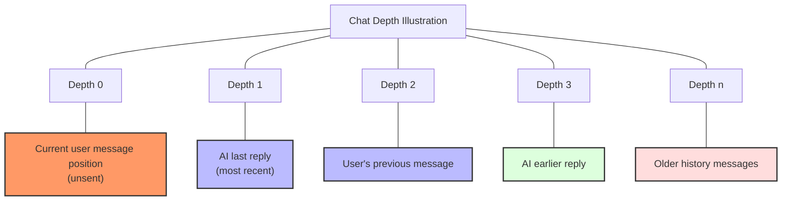
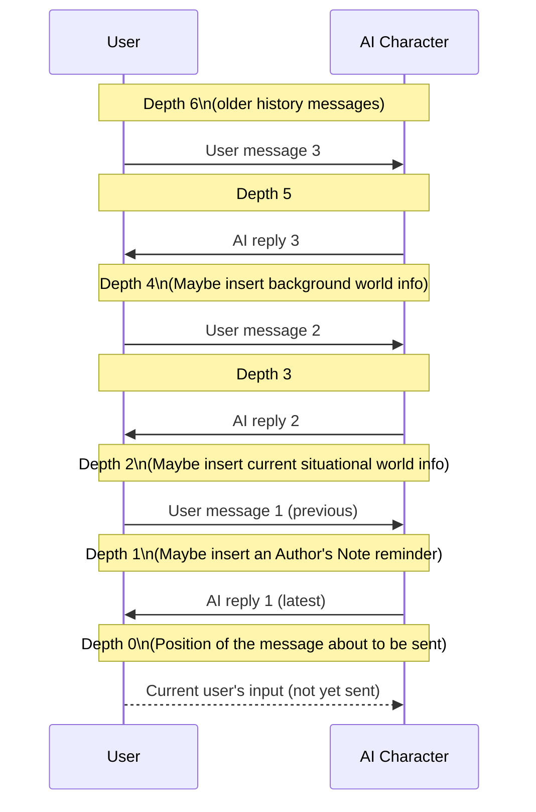

# SillyTavern Prompt Composition Explained

## 1. Basic Component Introduction

SillyTavern constructs a complete prompt system from multiple components, each with a specific function and scope:

### 1. Role Card Components
- Character Description: Defines the character's appearance, background and basic info
- Character Personality: Describes personality traits and behavioral patterns
- Scenario: Provides the initial scenario for interactions between the character and user
- Example Messages: Shows the character's dialogue style and interaction examples

### 2. World Info Components
- World Info Before: Background information placed at the front of the prompt
- World Info After: Supplementary background information placed after the main prompt
- Depth-activated World Info: World info dynamically inserted based on chat depth

### 3. System Settings Components
- System Prompt: Global rules that control overall AI behavior
- Persona/Jailbreak (Instant Prompts): Prompts for specific styles or to bypass restrictions
- Bias (Preferences): Guidance to steer the AI's reply tendencies
- Author's Note / Creator Note: Flexible guidance text that can be inserted

### 4. Conversation Components
- Chat History: Previous conversation content
- User Message: The message the user just sent

## 2. Prompt Assembly Process Details

### Step 1: Initialize the generation request

When the user sends a message, SillyTavern calls the Generate function to start processing:

```javascript
export async function Generate(type, { automatic_trigger, force_name2, quiet_prompt, quietToLoud, skipWIAN, force_chid, signal, quietImage, quietName, depth = 0 } = {}, dryRun = false) {
    // Prepare the generation environment...
    const abort_controller = new AbortController();
    abortController = abort_controller;
    // ...
}
```

### Step 2: Prepare character information

The system loads and processes basic data from the role card:

```javascript
// 1. Get basic character settings
const context = getContext();
name1 = context.name1; // user name
name2 = context.name2; // character name
character = context.characters[context.characterId]; // character data
// ...

// 2. Extract role card contents
const storyStringParams = {
    description: description,     // character appearance description
    personality: personality,     // character personality
    persona: persona,             // persona setting for user
    scenario: scenario,           // scenario description
    system: system,               // system behavior instructions
    char: name2,                  // character name
    user: name1,                  // user name
    // ...
};

// 3. Format the character information
const storyString = renderStoryString(storyStringParams);
```

### Step 3: Process World Info

The system performs a complex retrieval and activation process for world info:

```javascript
// 1. Prepare chat content to scan for world info activation
const chatForWI = coreChat.map(x => world_info_include_names ? `${x.name}: ${x.mes}` : x.mes).reverse();

// 2. Get activated world info
const { worldInfoString, worldInfoBefore, worldInfoAfter, worldInfoExamples, worldInfoDepth } = 
    await getWorldInfoPrompt(chatForWI, this_max_context, dryRun);
```

Inside getWorldInfoPrompt the workflow is:

1. Create a chat buffer:
```javascript
const buffer = new WorldInfoBuffer(chat);
```

2. Retrieve and sort world info entries:
```javascript
const sortedEntries = await getSortedEntries();
```

3. Scan activation conditions:
```javascript
for (let entry of sortedEntries) {
    // Skip if disabled
    if (entry.disable == true) {
        continue;
    }
    
    // Check character filters
    if (entry.characterFilter && entry.characterFilter?.names?.length > 0) {
        // Determine whether to apply to the current character...
    }
    
    // Check primary keyword matches
    let primaryKeyMatch = entry.key.find(key => {
        const substituted = substituteParams(key);
        return substituted && buffer.matchKeys(textToScan, substituted.trim(), entry);
    });
    
    if (primaryKeyMatch) {
        // Handle secondary keyword matching logic...
        // Add to activated set
        activatedNow.add(entry);
    }
}
```

4. Organize activated entries:
```javascript
// Classify by position
const beforeEntries = [];
const afterEntries = [];
const depthEntries = [];

for (const entry of activatedEntries) {
    switch(entry.position) {
        case wi_anchor_position.before:
            beforeEntries.push(entry);
            break;
        case wi_anchor_position.after:
            afterEntries.push(entry);
            break;
        // ...other cases
    }
}
```

### Step 4: Build message history

The system processes and formats the chat history:

```javascript
// 1. Process chat history in reverse order (newest to oldest)
let chat2 = [];
for (let i = coreChat.length - 1, j = 0; i >= 0; i--, j++) {
    // Special handling for OpenAI
    if (main_api == 'openai') {
        chat2[i] = coreChat[j].mes;
        continue;
    }
    
    // General formatting
    chat2[i] = formatMessageHistoryItem(coreChat[j], isInstruct, false);
    
    // Handle special cases (first message, last message, etc.)
    if (j === 0 && isInstruct) {
        chat2[i] = formatMessageHistoryItem(coreChat[j], isInstruct, force_output_sequence.FIRST);
    }
    // ...
}

// 2. Collect enough messages as needed to fill context
let tokenCount = await getMessagesTokenCount();
let lastAddedIndex = -1;

// Collect history according to token budget
for (let i = 0; i < arrMes.length; i++) {
    // Check if token limit exceeded
    if (tokenCount >= token_budget) {
        break;
    }
    
    // Add the message to send list
    mesSend.push(finalMesSend[i]);
    lastAddedIndex = i;
    
    // Update token count
    // ...
}
```

### Step 5: API-specific handling

Different APIs require different prompt formats:

#### OpenAI API handling flow

```javascript
// 1. Prepare prompt templates
async function preparePromptsForChatCompletion({ Scenario, charPersonality, name2, worldInfoBefore, worldInfoAfter, charDescription, quietPrompt, bias, extensionPrompts, systemPromptOverride, jailbrea[...]
    // Create system prompt list
    const systemPrompts = [
        { role: 'system', content: formatWorldInfo(worldInfoBefore), identifier: 'worldInfoBefore' },
        { role: 'system', content: formatWorldInfo(worldInfoAfter), identifier: 'worldInfoAfter' },
        { role: 'system', content: charDescription, identifier: 'charDescription' },
        { role: 'system', content: charPersonalityText, identifier: 'charPersonality' },
        { role: 'system', content: scenarioText, identifier: 'scenario' },
        // ...
    ];
    
    // 2. Add extension prompts (Author's Note, Vector memory, etc.)
    // Tavern Extras - Summary
    const summary = extensionPrompts['1_memory'];
    if (summary && summary.value) systemPrompts.push({
        role: getPromptRole(summary.role),
        content: summary.value,
        identifier: 'summary',
        position: getPromptPosition(summary.position),
    });

    // Authors Note
    const authorsNote = extensionPrompts['2_floating_prompt'];
    if (authorsNote && authorsNote.value) systemPrompts.push({
        role: getPromptRole(authorsNote.role),
        content: authorsNote.value,
        identifier: 'authorsNote',
        position: getPromptPosition(authorsNote.position),
    });

    // Vectors Memory
    const vectorsMemory = extensionPrompts['3_vectors'];
    if (vectorsMemory && vectorsMemory.value) systemPrompts.push({
        role: 'system',
        content: vectorsMemory.value,
        identifier: 'vectorsMemory',
        position: getPromptPosition(vectorsMemory.position),
    });
}

// 3. Combine and tokenize messages
async function populateChatHistory(messages, prompts, chatCompletion, type, cyclePrompt) {
    // Add message history to the chat completion object
    for (const message of messages) {
        if (!message) continue;
        
        // Add message and set role
        chatCompletion.add(message);
    }
    
    // If continuing generation, add the cycle prompt
    if (cyclePrompt) {
        const message = new Message('assistant', cyclePrompt);
        chatCompletion.add(message);
    }
}
```

#### Text Completion API handling flow

```javascript
// Combine prompts into a single text blob
const combine = () => {
    // Merge messages
    mesSendString = finalMesSend.map((e) => `${e.extensionPrompts.join('')}${e.message}`).join('');
    
    // Add separators and preamble
    mesSendString = addChatsSeparator(mesSendString);
    mesSendString = addChatsPreamble(mesSendString);
    
    // Concatenate all elements in order
    let combinedPrompt = beforeScenarioAnchor +
        storyString +
        afterScenarioAnchor +
        mesExmString +
        mesSendString +
        generatedPromptCache;
    
    // Handle special formatting (e.g., collapsing newlines)
    if (power_user.collapse_newlines) {
        combinedPrompt = collapseNewlines(combinedPrompt);
    }
    
    return combinedPrompt;
};
```

### Step 6: Submit the generation request

Send the final request according to the API type:

```javascript
// OpenAI request
async function sendOpenAIRequest(type, messages, signal) {
    // Set request parameters
    const generate_data = {
        'messages': messages,
        'model': model,
        'temperature': Number(oai_settings.temp_openai),
        'frequency_penalty': Number(oai_settings.freq_pen_openai),
        'presence_penalty': Number(oai_settings.pres_pen_openai),
        'top_p': Number(oai_settings.top_p_openai),
        'max_tokens': oai_settings.openai_max_tokens,
        'stream': stream,
        // ...other params
    };
    
    // Send request
    const response = await fetch('/api/backends/chat-completions/openai', {
        method: 'POST',
        headers: getRequestHeaders(),
        body: JSON.stringify(generate_data),
        signal: signal,
    });
    
    // Handle response...
}

// Other APIs request
export async function sendGenerationRequest(type, data) {
    // Choose handling based on API
    if (main_api === 'openai') {
        return await sendOpenAIRequest(type, data.prompt, abortController.signal);
    }
    if (main_api === 'koboldhorde') {
        return await generateHorde(data.prompt, data, abortController.signal, true);
    }
    
    // Generic API request
    const response = await fetch(getGenerateUrl(main_api), {
        method: 'POST',
        headers: getRequestHeaders(),
        cache: 'no-cache',
        body: JSON.stringify(data),
        signal: abortController.signal,
    });
    
    // Process result...
    return await response.json();
}
```

## 3. Detailed Analysis of Prompt Components

### 1. Role Card Component Structure

Role cards mainly include the following fields; they are processed during prompt assembly:

```json
{
  "name": "Character Name",
  "description": "Character appearance and basic settings",
  "personality": "Description of the character's personality traits",
  "scenario": "Initial interaction scenario",
  "first_mes": "Character's first message",
  "mes_example": "Example dialogue content"
}
```

Default template used to render character information:
```
{{#if system}}{{system}}\n{{/if}}
{{#if description}}{{description}}\n{{/if}}
{{#if personality}}{{char}}'s personality: {{personality}}\n{{/if}}
{{#if scenario}}Scenario: {{scenario}}\n{{/if}}
{{#if persona}}{{persona}}\n{{/if}}
```

### 2. World Info Entry Structure

Each world info entry contains the following main properties:

```json
{
  "key": ["activationKeyword1", "activationKeyword2"],
  "keysecondary": ["secondaryKeyword1", "secondaryKeyword2"],
  "comment": "Entry note (not included in prompts)",
  "content": "Actual content of the entry",
  "constant": false,  // whether always active
  "selective": true,  // whether to use secondary keywords
  "order": 100,       // sorting priority
  "position": 0,      // position (0=before, 1=after)
  "disable": false,   // whether the entry is disabled
  "addMemo": false    // whether to use as a memo
}
```

World info activation logic:
1. Primary keywords must match to trigger an entry check
2. Secondary keywords are matched according to selected logic:
   - AND_ANY: primary keyword + any one secondary keyword
   - NOT_ALL: primary keyword + not all secondary keywords
   - NOT_ANY: primary keyword + none of the secondary keywords
   - AND_ALL: primary keyword + all secondary keywords

### 3. System Prompts Structure

Organization of system prompts and instant prompts:

```javascript
// Create system prompt list
const systemPrompts = [
    // Ordered prompts (have an identifier)
    { role: 'system', content: formatWorldInfo(worldInfoBefore), identifier: 'worldInfoBefore' },
    { role: 'system', content: formatWorldInfo(worldInfoAfter), identifier: 'worldInfoAfter' },
    { role: 'system', content: charDescription, identifier: 'charDescription' },
    { role: 'system', content: charPersonalityText, identifier: 'charPersonality' },
    { role: 'system', content: scenarioText, identifier: 'scenario' },
    // Unordered prompts (no identifier)
    { role: 'system', content: impersonationPrompt, identifier: 'impersonate' },
    { role: 'system', content: quietPrompt, identifier: 'quietPrompt' },
    { role: 'system', content: groupNudge, identifier: 'groupNudge' },
    { role: 'assistant', content: bias, identifier: 'bias' },
];
```

### 5. Creator Information (Author's Note) Structure

Author's Note is a flexible prompt component that can be periodically injected into the chat. It has these characteristics:

```javascript
export function setFloatingPrompt() {
    const context = getContext();
    
    // Get current chat's author note settings
    const chatNote = chat_metadata[metadata_keys.prompt] || '';
    const interval = Number(chat_metadata[metadata_keys.interval] || extension_settings.note.defaultInterval);
    
    // Determine if it should be inserted
    let shouldAddPrompt = extension_settings.note.enabled &&
                         (chatNote || (extension_settings.note.chara && 
                          getContext().characterId !== undefined));
    
    // Compute when to insert the message
    if (shouldAddPrompt && extension_settings.note.interval) {
        // Compute messages since last insertion
        // ...
        
        // Determine if insertion interval has been reached
        shouldAddPrompt = messagesSinceLastInsertion >= interval;
    }
    
    // Handle character-specific author notes
    if (shouldAddPrompt && extension_settings.note.chara && getContext().characterId !== undefined) {
        const charaNote = extension_settings.note.chara.find((e) => e.name === getCharaFilename());
        
        // Insert author note based on position
        if (charaNote && charaNote.useChara) {
            switch (charaNote.position) {
                case chara_note_position.before:
                    prompt = charaNote.prompt + '\n' + prompt;
                    break;
                case chara_note_position.after:
                    prompt = prompt + '\n' + charaNote.prompt;
                    break;
                default:
                    prompt = charaNote.prompt;
                    break;
            }
        }
    }
    
    // Set the extension prompt
    context.setExtensionPrompt(
        MODULE_NAME,
        prompt,
        chat_metadata[metadata_keys.position],
        chat_metadata[metadata_keys.depth],
        extension_settings.note.allowWIScan,
        chat_metadata[metadata_keys.role],
    );
}
```

Author's Note configuration options:
1. Prompt Content: The guidance text the author wants to inject into the conversation
2. Insertion Interval: Insert once every N messages
3. Insertion Depth: Position in the chat history where it should be inserted
4. Insertion Position:
   - before: inserted before messages
   - after: inserted after messages
   - replace: replace the entire chat segment
5. Insertion Role:
   - system: as a system instruction
   - user: as a user message
   - assistant: as an assistant reply

Special capabilities of author notes:
- Can be set specifically for a particular character
- Can be dynamically inserted based on chat depth
- Can act under different roles
- Can integrate with the world info system (optionally allow WI scanning)

## 4. Prompt Order and Priority Details

### OpenAI API prompt structure

```
[
  {"role": "system", "content": "World Info (before)"},
  {"role": "system", "content": "Character Description"},
  {"role": "system", "content": "Character Personality"},
  {"role": "system", "content": "Scenario"},
  {"role": "system", "content": "Other system prompts..."},
  {"role": "user", "content": "User message 1"},
  {"role": "assistant", "content": "Character reply 1"},
  {"role": "user", "content": "User message 2"},
  {"role": "assistant", "content": "Character reply 2"},
  ...
  {"role": "user", "content": "Current user message"},
  {"role": "assistant", "content": "bias (preference prompt)"}
]
```

### Text Completion API prompt structure

```
[System prompts]
[Role card information]
[World Info (before)]
[Example messages]
[Chat history]
[World Info (after)]
[UserName]: [current user message]
[CharacterName]: [bias (preference prompt)]
```

## 5. Advanced Features and Special Handling

### 1. Dynamic depth-based World Info

SillyTavern can dynamically insert world info based on chat depth:

```javascript
// Add all depth WI entries to prompts
flushWIDepthInjections();
if (Array.isArray(worldInfoDepth)) {
    worldInfoDepth.forEach((e) => {
        const joinedEntries = e.entries.join('\n');
        setExtensionPrompt(`customDepthWI-${e.depth}-${e.role}`, joinedEntries, extension_prompt_types.IN_CHAT, e.depth, false, e.role);
    });
}
```

### 1.1 Chat Depth Explained

Chat Depth is an important concept in SillyTavern; it denotes the relative position of messages in the chat history. Understanding chat depth is vital to control world info activation and author note insertion.

#### Basic concept of chat depth

Chat depth starts at 0 for the newest message and increases for older messages:
- Depth 0: the position of the current user message (about to be sent)
- Depth 1: the most recent message in history (usually the AI's last reply)
- Depth 2: the user's previous message
- Depth n: the nth message counting from newest to oldest



#### Chat depth usage scenarios

1. Author's Note insertion:
   - Can be set to insert at a specific depth
   - e.g., depth 0 inserts before the current message, depth 10 inserts before the 10th message in history

2. Depth-activated World Info:
   - World info can be set to activate only at certain depths
   - e.g., background lore introduced early in the conversation (larger depth), current situation near the most recent messages (smaller depth)

3. Lorebook depth control:
   - Control when certain background lore is introduced into chat
   - e.g., character background at larger depths vs current context at smaller depths

#### Practical effects of depth values



#### Implementation of depth in code

Chat depth handling in SillyTavern is mainly implemented like this:

```javascript
// Author's note with specific depth
context.setExtensionPrompt(
    MODULE_NAME,
    prompt,
    chat_metadata[metadata_keys.position],
    chat_metadata[metadata_keys.depth], // depth value set here
    extension_settings.note.allowWIScan,
    chat_metadata[metadata_keys.role],
);

// Depth-based world info activation
if (Array.isArray(worldInfoDepth)) {
    worldInfoDepth.forEach((e) => {
        // e.depth indicates this world info entry's activation depth
        setExtensionPrompt(`customDepthWI-${e.depth}-${e.role}`, joinedEntries, extension_prompt_types.IN_CHAT, e.depth, false, e.role);
    });
}

// When building message history, account for depth
for (let i = 0; i < coreChat.length; i++) {
    // Compute depth of current message
    const messageDepth = coreChat.length - i - 1;
    
    // Handle special insertions based on depth
    if (extensionPrompts[messageDepth]) {
        // Insert extension prompt at this depth
    }
}
```

#### Practical recommendations for chat depth

1. Story background: suitable to set at larger depths (e.g., 10–20) so base settings are introduced early
2. Character relationship changes: set at mid depths (e.g., 3–5) to reflect recent changes
3. Immediate guidance: suitable at depth 0–1 for direct control of current conversation
4. Cycling prompts: can be repeated at set depths to keep the AI focused on some important information

Using chat depth flexibly makes SillyTavern's prompt system more dynamic and intelligent, enabling immersive roleplay with coherent context management.

### 2. Instruct Mode handling

For models that support an instruction format, special formatting is applied:

```javascript
// Format example messages for instruct mode
if (mesExamplesArray && isInstruct) {
    mesExamplesArray = formatInstructModeExamples(mesExamplesArray, name1, name2);
}

// Add instruction-style formatting to messages
chat2[i] = formatMessageHistoryItem(coreChat[j], isInstruct, false);
```

### 3. Recursive World Info processing

World info entries can recursively activate other entries:

```javascript
// If some entries were activated this scan and recursion is enabled, set next scan state to recursion
if (activatedNow.size && world_info_recursive && count < MAX_RECURSIVE_SCANS) {
    nextScanState = scan_state.RECURSION;
    console.debug('[WI] Recursion triggered by entries', activatedNow);
    
    // Add the content of currently activated entries to the next recursive scan
    for (const entry of activatedNow) {
        if (entry.content) {
            buffer.addRecurse(entry.content);
        }
    }
}
```

### 4. Minimum activation mechanism

SillyTavern can ensure at least a minimum number of world info entries are activated:

```javascript
// If not enough entries are activated and the minimum activation feature is enabled, increase scan depth
if (world_info_min_activations > allActivatedEntries.size && 
    buffer.getDepth() < Math.min(MAX_SCAN_DEPTH, world_info_min_activations_depth_max)) {
    
    nextScanState = scan_state.MIN_ACTIVATIONS;
    buffer.increaseDepth();
    console.debug(`[WI] Increasing depth to ${buffer.getDepth()} to meet minimum activations (${allActivatedEntries.size}/${world_info_min_activations})`);
}
```

## 6. Summary

SillyTavern's prompt assembly is a carefully designed multi-stage process that lets users fine-tune AI replies through various settings:

1. Extract base information from the role card to form the character's foundation
2. Activate relevant world info via keyword matching to enrich context
3. Process user and character conversation based on chat history and the current message
4. Combine all components in a specific order and priority into the final prompt
5. Apply API-specific handling and format conversion
6. Send the prompt to the AI service and get the character's reply

This detailed prompt assembly mechanism enables SillyTavern to provide highly personalized and immersive AI roleplay experiences while remaining flexible enough to support different AI models and API requirements.

## 7. Prompt Composition Flowchart

```mermaid
flowchart TD
    A[User sends message] --> B[Initialize generation request]
    B --> C[Prepare character information]
    C --> D[Process world info]
    D --> E[Build message history]
    E --> F[API-specific handling]
    F --> G[Submit generation request]
    
    %% Character processing subprocess
    C --> C1[Load role card]
    C1 --> C2[Extract character description]
    C2 --> C3[Extract character personality]
    C3 --> C4[Extract scenario]
    C4 --> C5[Extract example messages]
    
    %% World info subprocess
    D --> D1[Create chat buffer]
    D1 --> D2[Retrieve world info entries]
    D2 --> D3[Scan for keyword matches]
    D3 --> D4[Check secondary keywords]
    D4 --> D5[Classify world info]
    D5 --> D6[Process recursive activation]
    D6 --> D7[Apply minimum activation mechanism]
    
    %% Message history subprocess
    E --> E1[Reverse order processing of chat history]
    E1 --> E2[Format messages]
    E2 --> E3[Handle special messages]
    E3 --> E4[Compute token counts]
    E4 --> E5[Truncate over-limit messages]
    
    %% API-specific subprocess
    F --> F1{API type decision}
    F1 -->|OpenAI| F2[Prepare system prompts]
    F1 -->|Text Completion| F3[Combine prompt text]
    F2 --> F4[Add extension prompts]
    F3 --> F4
    F4 --> F5[Handle special formatting]
    
    %% Generation subprocess
    G --> G1[Set request parameters]
    G1 --> G2[Add request headers]
    G2 --> G3[Send request]
    G3 --> G4[Handle response]
    
    %% World info classification
    D5 --> D5a[World Info (before)]
    D5 --> D5b[World Info (after)]
    D5 --> D5c[Depth-activated]
    
    %% Message formatting
    E2 --> E2a[OpenAI format]
    E2 --> E2b[Instruction format]
    E2 --> E2c[General format]
    
    %% Author's note subprocess
    F4 --> F4a[Check author note settings]
    F4a --> F4b[Compute insertion interval]
    F4b --> F4c{Insert author note?}
    F4c -->|Yes| F4d[Insert based on position]
    F4c -->|No| F4f[Skip author note]
    F4d --> F4e[Set insertion role]
    F4e --> F4
    F4f --> F4
    
    %% Style definitions
    classDef process fill:#f9f,stroke:#333,stroke-width:2px
    classDef decision fill:#bbf,stroke:#333,stroke-width:2px
    classDef subprocess fill:#dfd,stroke:#333,stroke-width:2px
    
    class A,B,C,D,E,F,G process
    class F1,F4c decision
    class C1,C2,C3,C4,C5,D1,D2,D3,D4,D5,D6,D7,E1,E2,E3,E4,E5,F2,F3,F4,F4a,F4b,F4d,F4e,F4f,F5,G1,G2,G3,G4 subprocess
```

This flowchart presents the end-to-end flow from the user sending a message to generating the final reply. It mainly includes these major phases:

1. Initialization: receive user message and prepare the generation environment
2. Character info processing: load and format various role card information
3. World info processing: activate related world info via keyword matching
4. Message history processing: format chat history and handle special messages
5. API-specific handling: includes the Author's Note injection subprocess
6. Generation request processing: send the request and handle the response

Each major phase contains many sub-processes that collaborate to ensure the final prompt accurately reflects character traits, scenario context, and conversational history.

```